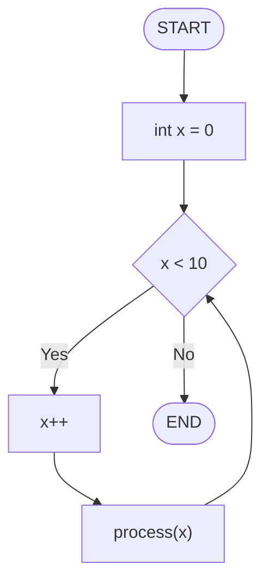

# Mermaid ↔ VueFlow 변환 구현 + 본 프로젝트 통합 방식

---

## 2번 문제: Mermaid ↔ VueFlow 공식 연동 없음

Vue Flow는 Mermaid를 위해 만들어진 라이브러리가 아니다.
완전히 별개의 다이어그램 엔진이라 서로 데이터 포맷이 다르다.

| | Mermaid | VueFlow |
|--|---------|---------|
| 포맷 | 텍스트 문자열 | `nodes[]` + `edges[]` 객체 배열 |
| 노드 | `A["label"]` | `{ id, type, position, data }` |
| 엣지 | `A --> B` | `{ id, source, target, label }` |
| 공식 변환 기능 | ❌ 없음 | ❌ 없음 |

공식 플러그인도, 공식 변환 유틸도 없다. **직접 구현해야 한다.**

---

## 해결안: 직접 파싱/직렬화 구현

두 방향 모두 직접 짰다.

```
Mermaid 텍스트 ──파싱──▶ VueFlow nodes/edges    (useMermaidParser.js)
VueFlow nodes/edges ──직렬화──▶ Mermaid 텍스트  (useFlowToMermaid.js)
```

---

## Mermaid → VueFlow 파싱 (`useMermaidParser.js`)

### 전체 흐름

```
Mermaid 텍스트
  ↓ 줄 단위로 순회
  ├─ flowchart TD/LR/... 줄  → direction 추출
  ├─ style/classDef/%% 줄   → preservedLines[] 에 보관 (나중에 복원)
  ├─ 엣지 줄 (A --> B)       → rawEdges[] + 양 끝 노드 추출
  └─ 단독 노드 줄 (A["..."])  → nodesMap에 추가
  ↓
레이아웃 계산 (BFS 위상 정렬 → X/Y 좌표 부여)
  ↓
VueFlow 포맷으로 변환 반환
```

### 지원 노드 shape

정규식 패턴으로 각 shape를 구분한다.

| Mermaid 문법 | shape 이름 | 모양 |
|-------------|-----------|------|
| `A["label"]` | `default` | 사각형 |
| `A("label")` | `round` | 둥근 사각형 |
| `A{"label"}` | `diamond` | 마름모 |
| `A(["label"])` | `stadium` | 타원 |
| `A(("label"))` | `circle` | 원 |
| `A[/"label"/]` | `parallelogram` | 평행사변형 |

### 지원 엣지 문법

```
A --> B              (레이블 없음)
A -->|label| B       (파이프 레이블)
A -- label --> B     (인라인 레이블)
A -.-> B             (점선, arrow로 처리)
A ==> B              (굵은 화살표, arrow로 처리)
```

### 레이아웃: BFS 위상 정렬

파싱 후 노드 좌표를 자동으로 계산한다.
VueFlow는 `position: { x, y }` 를 반드시 줘야 하기 때문이다.

```
1. 부모 없는 노드(루트)를 시작점으로 BFS
2. 각 노드에 depth(레이어) 배정
3. 같은 depth의 노드들을 가로/세로로 균등 배치 (중앙 정렬)
4. direction(TD/LR/BT/RL)에 따라 축 방향 결정

※ 사이클이 있어도 처리 가능:
   depth 미할당 노드에 대해 "부모 중 할당된 것의 max depth + 1"을 반복 전파
```

### preservedLines — 파싱 불가 줄 보존

`style`, `classDef`, `subgraph`, `%%`(주석) 등은 파싱하지 않고 그대로 보관한다.
VueFlow → Mermaid 역변환 시 마지막에 다시 붙여서 원본 정보를 유지한다.

```
입력:
  flowchart TD
  A["시작"] --> B{조건}
  style A fill:#f9f

파싱 결과:
  nodes: [A, B]
  edges: [A→B]
  preservedLines: ["  style A fill:#f9f"]   ← 보존됨
```

---

## VueFlow → Mermaid 직렬화 (`useFlowToMermaid.js`)

### 변환 로직

```
1. "flowchart {direction}" 헤더 출력
2. nodes 배열 순회 → 각 노드의 shape에 따라 Mermaid 노드 문법 생성
3. edges 배열 순회 → 레이블 유무에 따라 엣지 문법 생성
4. preservedLines 복원 (style, classDef 등)
```

### shape → Mermaid 문법 매핑

```js
switch (shape) {
  case 'diamond':       → `A{"label"}`
  case 'stadium':       → `A(["label"])`
  case 'circle':        → `A(("label"))`
  case 'round':         → `A("label")`
  case 'parallelogram': → `A[/"label"/]`
  default:              → `A["label"]`
}
```

### 엣지 직렬화

```js
// 레이블 있음
`  A -->|"label"| B`

// 레이블 없음
`  A --> B`
```

특수문자 처리: 레이블 안의 큰따옴표(`"`)는 작은따옴표(`'`)로 자동 치환 (Mermaid 문법 충돌 방지).

---

## 본 프로젝트에서 iife.js + css가 어떻게 사용되는가

### 전체 흐름 처음부터 끝까지

```
[사용자가 DesignCode.jsp 또는 DesignModel.jsp 페이지 로드]
        ↓
JSP include 체인:
  DesignCode.jsp
    └── ControlFlowGraphTab.jspf
          └── CfgSettingModal.jspf   ← 여기서 리소스 로드
                ├── <link> mermaid-flow-editor.css    로드
                ├── <link> CfgSettingModal.css        로드
                └── (HTML 구조 삽입: 모달 + 마운트 포인트)

페이지 body 하단:
  <script> mermaid-flow-editor.iife.js  로드  → window.MermaidFlowEditor 등록
  <script> CfgSettingModal.js           로드  → cfgSettingModalVue (Vue 2) 등록
```

### CfgSettingModal.jspf의 핵심 구조

```html
<!-- 리소스 로드 -->
<link rel="stylesheet" href=".../mermaid-flow-editor.css">
<link rel="stylesheet" href=".../CfgSettingModal.css">

<!-- Vue 2 앱 루트 -->
<div id="cfgSettingModalVue">
  <div class="modal" id="cfgSettingModal">

    <!-- 탭 버튼 3개 -->
    <button @click="switchToCodeView">Mermaid 코드</button>
    <button @click="switchToGuiView">GUI 편집기</button>
    <button @click="isSourceView = true">소스 코드</button>

    <!-- 뷰 전환 영역 -->
    <textarea v-if="!isSourceView && !isGuiView" v-model="diagram">  ← 코드 편집
    <div id="mermaid-gui-editor" v-show="isGuiView"></div>           ← GUI 에디터 마운트 포인트
    <div id="source-data" v-if="isSourceView">                       ← 소스 코드 뷰

  </div>
</div>

<!-- 번들 + 제어 로직 로드 -->
<script src=".../mermaid-flow-editor.iife.js"></script>   ← window.MermaidFlowEditor 등록
<script src=".../CfgSettingModal.js"></script>             ← Vue 2 cfgSettingModalVue 등록
```

> **`v-show` vs `v-if`**: 마운트 포인트에 `v-if`를 쓰면 Vue 2가 탭 전환 시 DOM을 완전히 제거한다.
> 이미 `app.mount()`된 상태에서 DOM이 사라지면 Vue 3 앱이 충돌한다.
> 그래서 `v-show`(display:none으로 숨김)를 사용 — DOM은 유지, 화면만 숨김.

### GUI 편집기 탭 클릭 시 (마운트)

```
사용자: "GUI 편집기" 탭 클릭
  ↓
Vue 2: switchToGuiView() 호출
  ↓
isGuiView = true → #mermaid-gui-editor div 표시 (v-show)
  ↓
$nextTick + requestAnimationFrame → DOM 렌더 완료 후
  ↓
_mountGuiEditor() 실행:
  1. window.MermaidFlowEditor 존재 확인
  2. changeHandler 등록 (mermaid-flow-editor:change 이벤트 수신)
  3. window.MermaidFlowEditor.mount('#mermaid-gui-editor', this.diagram)
        ↓
        [IIFE 내부: Vue 3 앱 생성]
          → MermaidFlowEditor.vue 마운트
          → parseMermaid(initialMermaid) 실행
          → VueFlow 캔버스 렌더링
  4. 반환된 instance → this._guiEditorInstance 에 보관
```

### 사용자가 GUI에서 노드/엣지 편집 시

```
사용자: 노드 이동 / 엣지 추가 / 레이블 수정
  ↓
[IIFE 내부: Vue 3]
  VueFlow 상태 변경 감지
  → toMermaid(nodes, edges, direction, preservedLines) 실행
  → Mermaid 텍스트 생성
  → onMermaidChange(newCode) 콜백 호출
  → el.dispatchEvent(CustomEvent('mermaid-flow-editor:change', { mermaid: newCode }))
  ↓
[Vue 2: changeHandler]
  event.detail.mermaid 수신
  → this.diagram = newCode    (Vue 2 반응형 데이터 업데이트)
  → this.renderMermaid()      (오른쪽 미리보기 패널 실시간 갱신)
```

### "Mermaid 코드" 탭으로 전환 시 (언마운트)

```
사용자: "Mermaid 코드" 탭 클릭
  ↓
Vue 2: switchToCodeView() 호출
  ↓
this._guiEditorInstance.getMermaid()
  → IIFE 클로저에서 currentMermaid 동기 반환
  → this.diagram 에 반영 (최신 코드 flush)
  ↓
_unmountGuiEditor() 실행:
  1. this._guiEditorInstance.unmount()
        → [IIFE 내부] app.unmount() → Vue 3 앱 정리
  2. removeEventListener('mermaid-flow-editor:change', ...)
  3. this._guiEditorInstance = null
  ↓
isGuiView = false → textarea 다시 표시
renderMermaid() → 오른쪽 미리보기 갱신
```

### 모달 닫기 시

```
showModal = false
  ↓
watch: showModal → false
  → _unmountGuiEditor()   (이미 마운트된 경우 정리)
  → isGuiView = false
```

---

## 전체 데이터 흐름 요약

```
[DB에서 불러온 Mermaid 코드]
        │
        ▼
  this.diagram (Vue 2 data)
        │
        ├─── [코드 탭] textarea v-model ────────────────▶ 직접 편집
        │
        ├─── [GUI 탭] mount('#mermaid-gui-editor', diagram)
        │                   │
        │              parseMermaid()
        │                   │
        │            VueFlow 캔버스 렌더링
        │                   │
        │              사용자 GUI 편집
        │                   │
        │             toMermaid()
        │                   │
        │         CustomEvent('mermaid-flow-editor:change')
        │                   │
        │◀──────────── this.diagram 업데이트
        │
        ▼
  saveCfgInfo()
  → Mermaid 텍스트 + PNG 이미지 → 서버 저장
```

---

## 두 문제 해결 방식 비교

| | 1번 문제 (Vue 2 충돌) | 2번 문제 (변환 기능 없음) |
|--|----------------------|--------------------------|
| **해결 방식** | IIFE 번들로 런타임 격리 | 직접 파싱/직렬화 구현 |
| **핵심 파일** | `vite.config.js`, `main.js` | `useMermaidParser.js`, `useFlowToMermaid.js` |
| **외부 의존** | Vite 빌드 도구 | 없음 (순수 JS 로직) |
| **유지보수 포인트** | Mermaid 문법 추가 시 정규식 확장 필요 | 동일 |

---

## 파싱 손실 문제 분석

### Mermaid의 복잡한 기능들 — 파싱 변환 불가 목록

Mermaid flowchart는 단순 노드/엣지 외에도 다양한 기능을 지원한다.
이 중 VueFlow로 직접 변환할 수 없는 기능들은 다음과 같다.

| 기능 | Mermaid 문법 | 변환 가능 여부 | 처리 방식 |
|------|-------------|--------------|----------|
| 노드 / 엣지 | `A --> B` | ✅ 가능 | 완전 변환 |
| 노드 shape | `A{"label"}` 등 6종 | ✅ 가능 | 완전 변환 |
| 엣지 레이블 | `A -->|label| B` | ✅ 가능 | 완전 변환 |
| 방향 선언 | `flowchart TD/LR/BT/RL` | ✅ 가능 | 완전 변환 |
| 인라인 스타일 | `style A fill:#f9f` | ⚠️ 불가 | preservedLines 보존 |
| 클래스 정의 | `classDef myClass fill:#f9f` | ⚠️ 불가 | preservedLines 보존 |
| 클래스 적용 | `class A myClass` | ⚠️ 불가 | preservedLines 보존 |
| 서브그래프 | `subgraph title ... end` | ⚠️ 불가 | preservedLines 보존 |
| 클릭 이벤트 | `click A callback` | ⚠️ 불가 | preservedLines 보존 |
| 주석 | `%% comment` | ⚠️ 불가 | preservedLines 보존 |
| linkStyle | `linkStyle 0 stroke:#f66` | ⚠️ 불가 | preservedLines 보존 |

"불가" 항목들은 **파싱 시 무시되지 않고 `preservedLines`에 보관**된다.
VueFlow → Mermaid 역변환 시 끝에 복원되므로 데이터 자체는 유실되지 않는다.
단, GUI 편집기에서 해당 속성들을 시각적으로 편집하는 기능은 없다.

---

### preservedLines — 파싱 손실을 막는 안전망

#### 왜 필요한가

Mermaid → VueFlow → Mermaid 왕복 변환을 하면 이론상 데이터 손실이 생긴다.

```
입력 Mermaid
  flowchart TD
  A["시작"] --> B{"조건"}
  style A fill:#f9f,stroke:#333      ← VueFlow에 대응 개념 없음
  classDef redBox fill:#f66          ← VueFlow에 대응 개념 없음
  class B redBox                     ← VueFlow에 대응 개념 없음

파싱 후 VueFlow 상태
  nodes: [A, B]
  edges: [A→B]
  (style/classDef/class 정보는 VueFlow 객체에 없음)

VueFlow → Mermaid 역변환
  flowchart TD
  A["시작"]
  B{"조건"}
  A --> B
  ← style, classDef, class 줄이 사라짐  ← 손실
```

이 손실을 막기 위해 `preservedLines`를 도입했다.

#### 동작 방식

파싱 시 VueFlow로 변환할 수 없는 줄을 **버리지 않고** 별도 배열에 그대로 보관한다.

```js
// useMermaidParser.js — 파싱 불가 줄 판별 정규식
const RE_SKIP = /^\s*(?:%%|style\s|classDef\s|class\s|click\s|subgraph\s|end\s*$)/i

// 파싱 루프 내부
if (RE_SKIP.test(trimmed)) {
  preservedLines.push(raw)   // 버리지 않고 보관
  continue
}

// 아무 패턴에도 안 맞는 줄도 보관
preservedLines.push(raw)
```

역변환 시 노드/엣지 직렬화가 끝난 후 마지막에 붙여서 복원한다.

```js
// useFlowToMermaid.js — 역변환 마지막 단계
if (preservedLines && preservedLines.length > 0) {
  lines.push('')
  preservedLines.forEach(l => lines.push(l))  // 원본 줄 그대로 복원
}
```

#### 왕복 변환 후 결과

```
입력:
  flowchart TD
  A["시작"] --> B{"조건"}
  style A fill:#f9f
  classDef redBox fill:#f66
  class B redBox

파싱 결과:
  nodes: [A, B]          ← VueFlow로 편집 가능
  edges: [A→B]           ← VueFlow로 편집 가능
  preservedLines: [      ← 건드리지 않고 보관
    "  style A fill:#f9f",
    "  classDef redBox fill:#f66",
    "  class B redBox"
  ]

GUI 편집 후 역변환:
  flowchart TD
  A["시작"]
  B{"조건"}

  A --> B

  style A fill:#f9f       ← 복원됨
  classDef redBox fill:#f66  ← 복원됨
  class B redBox          ← 복원됨
```

노드/엣지는 GUI에서 자유롭게 편집하면서, 편집 불가 속성들은 원본 그대로 살아있다.

#### preservedLines의 한계

보관은 하지만 GUI에서 시각적으로 반영되지는 않는다.

예를 들어 `style A fill:#f9f` 가 있어도 GUI 캔버스에서 A 노드가 분홍색으로 보이지는 않는다.
텍스트 그대로 보관했다가 역변환 시 복원하는 것이지, 스타일을 해석해서 적용하는 게 아니기 때문이다.

즉:
- **데이터 유실** — 없음 (텍스트로 보존)
- **GUI 시각화** — 없음 (편집 불가, 보이지 않음)
- **최종 저장 코드** — 원본 속성 유지됨

Alira CFG 출력에는 이 항목들이 포함되지 않으므로, 실제 사용 시나리오에서는 이 한계가 문제가 되지 않는다.

---

### Alira가 생성하는 Mermaid 코드의 실제 수준

Alira는 **C 함수 소스코드를 입력받아 제어 흐름 그래프(CFG, Control Flow Graph)를 Mermaid로 출력**한다.

CFG는 "이 코드가 어떤 순서로 실행되는가"를 나타내는 그래프다.
구성 요소는 구조적으로 단순하다:

| CFG 구성 요소 | 대응하는 Mermaid 요소 |
|--------------|----------------------|
| 시작/종료 블록 | `A(["START"])` — stadium shape |
| 코드 실행 블록 | `A["코드 내용"]` — 사각형 |
| 조건 분기 (if/switch) | `A{"condition"}` — diamond shape |
| 제어 흐름 | `A --> B` — 단순 화살표 |
| 분기 레이블 | `A -->|Yes| B`, `A -->|No| C` |

CFG의 목적 자체가 **"실행 흐름 표현"** 이다.
스타일링(`style`, `classDef`), 그룹화(`subgraph`), 인터랙션(`click`) 같은 장식적 기능이 필요 없다.

---

### Alira 출력 코드 구조 (실제 패턴)

Alira가 생성하는 CFG Mermaid 코드는 아래 패턴으로만 구성된다.



이 출력에 포함되는 요소:
- `flowchart TD` — 방향 선언 ✅
- 노드 정의 (default, diamond, stadium shape) ✅
- `-->` 화살표 ✅
- `-->|label|` 레이블 화살표 ✅

이 출력에 **포함되지 않는** 요소:
- `style` / `classDef` / `class` ❌
- `subgraph` ❌
- `click` ❌
- `%%` 주석 ❌
- `linkStyle` ❌

---

### 결론: Alira 출력 수준에서 파싱 손실 없음

파서(`useMermaidParser.js`)가 완전히 처리하는 문법 범위와 Alira가 실제로 사용하는 문법 범위가 **완전히 일치**한다.

```
파서 완전 지원 범위
┌────────────────────────────────────────────────┐
│  flowchart TD/LR/BT/RL                         │
│  노드 6종 shape (default/round/diamond/        │
│         stadium/circle/parallelogram)          │
│  --> / -->|label| / -- label --> 엣지          │
│  -.-> / ==> (점선/굵은 화살표)                  │
└────────────────────────────────────────────────┘
        ↑
Alira CFG 출력이 사용하는 범위 = 이 안에 완전히 포함됨
```

Alira가 생성하는 CFG는 "노드 + 방향 있는 엣지"가 전부다.
이 수준에서 GUI 편집기로 가져올 때 **데이터 손실은 발생하지 않는다.**
